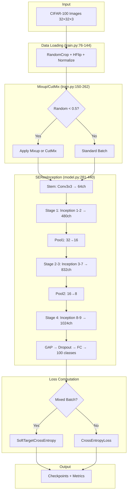

## Analysis: SE-Res-Inception CIFAR-100 Training System

### Overview

This codebase implements **SE-Res-Inception V2**, a modified GoogLeNet (Inception V1) architecture enhanced with Squeeze-and-Excitation blocks, residual connections, stochastic depth, and Mixup/CutMix data augmentation for training on CIFAR-100. The system targets NVIDIA RTX 5070 Ti with Mixed Precision Training (AMP) and CUDA 12.8 support.

---

### Entry Points

| File | Purpose |
|------|---------|
| `train.py:817-818` | Main training entry point via [main()](cci:1://file:///c:/Users/Omar/Documents/Coding/Goog-ResSkips-SE_Net/visualize_gradcam.py:100:0-170:14) |
| `model.py:476-492` | Model testing entry point via [get_model_summary()](cci:1://file:///c:/Users/Omar/Documents/Coding/Goog-ResSkips-SE_Net/model.py:442:0-472:22) |
| `plot_metrics.py:78-79` | Metrics plotting entry point via [plot_training_curves()](cci:1://file:///c:/Users/Omar/Documents/Coding/Goog-ResSkips-SE_Net/plot_metrics.py:16:0-74:14) |
| `evaluate_superclass.py:118-119` | Superclass evaluation entry point via [evaluate()](cci:1://file:///c:/Users/Omar/Documents/Coding/Goog-ResSkips-SE_Net/evaluate_superclass.py:56:0-115:14) |
| `visualize_gradcam.py:173-174` | GradCAM visualization entry point via [main()](cci:1://file:///c:/Users/Omar/Documents/Coding/Goog-ResSkips-SE_Net/visualize_gradcam.py:100:0-170:14) |
| `env_val.py:1-3` | CUDA environment validation |

---

### Core Implementation

#### 1. Model Architecture ([model.py](cci:7://file:///c:/Users/Omar/Documents/Coding/Goog-ResSkips-SE_Net/model.py:0:0-0:0))

##### 1.1 SEBlock (`model.py:28-60`)

The Squeeze-and-Excitation block implements channel-wise attention:

```
Squeeze:    (B, C, H, W) → AdaptiveAvgPool2d(1) → (B, C, 1, 1) → view → (B, C)
Excitation: (B, C) → Linear(C → C//16) → ReLU → Linear(C//16 → C) → Sigmoid → (B, C)
Scale:      (B, C, H, W) * (B, C, 1, 1) → (B, C, H, W)
```

- Line 44: Reduction ratio defaults to 16, with minimum 8 channels enforced via `max(channels // reduction, 8)`
- Line 46-50: Excitation path uses two linear layers with ReLU and Sigmoid activations

##### 1.2 DropPath (Stochastic Depth) (`model.py:63-97`)

Implements stochastic depth regularization:

- Line 82-83: During inference or when `drop_prob=0`, returns input unchanged
- Line 86-91: During training, creates per-sample binary mask with shape [(batch_size, 1, 1, 1)](cci:1://file:///c:/Users/Omar/Documents/Coding/Goog-ResSkips-SE_Net/visualize_gradcam.py:100:0-170:14)
- Line 94: Scales output by `1/keep_prob` to maintain expected value

##### 1.3 InceptionBranch (`model.py:100-167`)

Each branch type constructs a different convolution path:

| Branch Type | Structure | Line Range |
|-------------|-----------|------------|
| `'1x1'` | Conv1x1 → BN → ReLU | 129-134 |
| `'3x3'` | Conv1x1 → BN → ReLU → Conv3x3 → BN → ReLU | 136-144 |
| `'5x5'` | Conv1x1 → BN → ReLU → Conv5x5 → BN → ReLU | 146-154 |
| `'pool'` | MaxPool3x3 → Conv1x1 → BN → ReLU | 156-162 |

All convolutions use `bias=False` since BatchNorm follows.

##### 1.4 ResInceptionBlock (`model.py:170-278`)

The core building block combines Inception branches with residual connections:

**Forward Pass Flow (`model.py:249-278`):**
1. Line 251: Store identity for residual connection
2. Lines 254-257: Execute four parallel branches (1x1, 3x3, 5x5, pool)
3. Line 260: Concatenate branch outputs along channel dimension
4. Line 264: Apply SE attention after concatenation
5. Line 267: Apply Dropout2d for regularization
6. Line 271: Apply DropPath (stochastic depth) to transformed features
7. Line 274-276: Add residual projection and apply final ReLU

**Residual Projection (`model.py:238-244`):**
- If `in_channels != out_channels`: Conv1x1 → BatchNorm
- Otherwise: Identity pass-through

##### 1.5 SEResInception Network (`model.py:281-440`)

The full network architecture processes input through stages:

**Stem Layer (`model.py:325-329`):**
- Conv3x3 (stride=1, padding=1) → BN → ReLU
- Input: (B, 3, 32, 32) → Output: (B, 64, 32, 32)

**Stochastic Depth Schedule (`model.py:334`):**
```python
drop_rates = [drop_path_rate * i / (self.num_blocks - 1) for i in range(self.num_blocks)]
```
Linear increase from 0 to `drop_path_rate` across 9 blocks.

**Stage Configurations (`model.py:340-387`):**

| Stage | Blocks | Input Channels | Output Channels | Spatial Size |
|-------|--------|----------------|-----------------|--------------|
| 1 | inception1-2 | 64 → 256 → 480 | 480 | 32×32 |
| Pool1 | MaxPool | 480 | 480 | 32→16 |
| 2 | inception3-4 | 480 → 512 → 512 | 512 | 16×16 |
| 3 | inception5-7 | 512 → 528 → 832 → 832 | 832 | 16×16 |
| Pool2 | MaxPool | 832 | 832 | 16→8 |
| 4 | inception8-9 | 832 → 832 → 1024 | 1024 | 8×8 |

**Classifier Head (`model.py:391-393`):**
- AdaptiveAvgPool2d(1) → Dropout(0.5) → Linear(1024, 100)

**Weight Initialization (`model.py:398-409`):**
- Conv2d: Kaiming normal (fan_out, ReLU)
- BatchNorm2d: weight=1, bias=0
- Linear: Normal(0, 0.01), bias=0

---

#### 2. Training Pipeline ([train.py](cci:7://file:///c:/Users/Omar/Documents/Coding/Goog-ResSkips-SE_Net/train.py:0:0-0:0))

##### 2.1 Configuration (`train.py:39-70`)

All hyperparameters centralized in [Config](cci:2://file:///c:/Users/Omar/Documents/Coding/Goog-ResSkips-SE_Net/train.py:38:0-69:57) class:

| Parameter | Value | Line |
|-----------|-------|------|
| BATCH_SIZE | 128 | 48 |
| LEARNING_RATE | 1e-3 | 49 |
| WEIGHT_DECAY | 5e-4 | 50 |
| DROPOUT | 0.4 | 51 |
| MIXUP_CUTMIX_PROB | 0.5 | 56 |
| CUTMIX_PROB | 0.5 | 57 |
| USE_AMP | True | 70 |

##### 2.2 Data Loading (`train.py:76-144`)

**Normalization Statistics (`train.py:89-90`):**
```python
mean = (0.5071, 0.4867, 0.4408)
std = (0.2675, 0.2565, 0.2761)
```

**Training Augmentations (`train.py:93-98`):**
- RandomCrop(32, padding=4)
- RandomHorizontalFlip()
- ToTensor()
- Normalize()

**DataLoader Configuration (`train.py:123-139`):**
- `pin_memory=True` for CUDA transfer optimization
- `persistent_workers=True` when `num_workers > 0`

##### 2.3 Mixup/CutMix Augmentation (`train.py:150-262`)

**Mixup (`train.py:150-182`):**
1. Line 172: Sample λ from Beta(α, α) distribution
2. Line 177: Generate random permutation indices
3. Line 179: Mix images: `mixed_x = λ * x + (1-λ) * x[permuted]`
4. Line 180: Return both original and permuted targets

**CutMix (`train.py:220-262`):**
1. Line 243: Sample λ from Beta(α, α)
2. Line 253: Generate random bounding box via [rand_bbox()](cci:1://file:///c:/Users/Omar/Documents/Coding/Goog-ResSkips-SE_Net/train.py:184:0-216:33)
3. Line 256-257: Clone and paste region from permuted samples
4. Line 260: Adjust λ based on actual cut area ratio

**Bounding Box Generation (`train.py:185-217`):**
- Line 203: Box size = `sqrt(1 - λ)` of image dimensions
- Lines 212-215: Random center point, clipped to image bounds

##### 2.4 Soft-Target Loss (`train.py:268-347`)

**SoftTargetCrossEntropy Forward (`train.py:284-319`):**
1. Line 304: Compute log_softmax for numerical stability
2. Lines 310-311: Create label-smoothed one-hot vectors for both targets
3. Line 314: Mix smoothed targets: `lam * smooth_a + (1-lam) * smooth_b`
4. Line 317: Cross-entropy: `-sum(soft_targets * log_probs)`

**Label Smoothing (`train.py:321-347`):**
- Line 336-337: off_value = smoothing/num_classes, on_value = 1 - smoothing + off_value
- Line 345: Scatter on_value into one-hot positions

##### 2.5 Training Loop (`train.py:492-573`)

**Per-Batch Processing (`train.py:520-571`):**
1. Line 524: Zero gradients with `set_to_none=True` for efficiency
2. Line 527: Random coin flip for Mixup/CutMix (50% probability)
3. Lines 529-540: Apply either CutMix or Mixup based on second coin flip
4. Lines 543-545: Forward pass with autocast for AMP
5. Lines 559-561: Backward pass with GradScaler

**Validation (`train.py:576-616`):**
- Line 589: Model set to eval mode
- Line 596: No-grad context for inference
- Line 602-604: Standard cross-entropy (no Mixup/CutMix)

##### 2.6 Checkpointing (`train.py:619-675`)

**Checkpoint Contents (`train.py:631-638`):**
- `model_state_dict`
- `optimizer_state_dict`
- `scheduler_state_dict`
- `scaler_state_dict` (for AMP)
- [epoch](cci:1://file:///c:/Users/Omar/Documents/Coding/Goog-ResSkips-SE_Net/train.py:473:4-475:52), `best_acc`

**Resume Logic (`train.py:646-675`):**
- Loads all state dicts to restore training position
- Returns [(start_epoch, best_acc)](cci:1://file:///c:/Users/Omar/Documents/Coding/Goog-ResSkips-SE_Net/visualize_gradcam.py:100:0-170:14) for loop initialization

##### 2.7 Metrics Tracking (`train.py:410-486`)

**MetricsTracker Class:**
- [update()](cci:1://file:///c:/Users/Omar/Documents/Coding/Goog-ResSkips-SE_Net/train.py:451:4-459:19) at line 452-460: Appends metrics and auto-saves
- [save()](cci:1://file:///c:/Users/Omar/Documents/Coding/Goog-ResSkips-SE_Net/train.py:461:4-471:9) at line 462-472: Persists as `.npz` with numpy arrays
- [load()](cci:1://file:///c:/Users/Omar/Documents/Coding/Goog-ResSkips-SE_Net/train.py:434:4-449:20) at line 435-450: Restores from disk for resume support

---

#### 3. Evaluation Scripts

##### 3.1 Superclass Evaluation ([evaluate_superclass.py](cci:7://file:///c:/Users/Omar/Documents/Coding/Goog-ResSkips-SE_Net/evaluate_superclass.py:0:0-0:0))

**Superclass Mapping (`evaluate_superclass.py:23-34`):**
A 100-element list mapping each fine-grained CIFAR-100 class index to one of 20 coarse superclass indices.

**Evaluation Flow (`evaluate_superclass.py:57-116`):**
1. Lines 61-72: Load model from checkpoint, handling both dict and raw state_dict formats
2. Lines 78-85: Run inference, collecting predictions and targets
3. Lines 89-90: Map predictions and targets to superclasses
4. Lines 93-98: Calculate accuracy by counting matches
5. Lines 101-115: Generate normalized confusion matrix heatmap

##### 3.2 GradCAM Visualization ([visualize_gradcam.py](cci:7://file:///c:/Users/Omar/Documents/Coding/Goog-ResSkips-SE_Net/visualize_gradcam.py:0:0-0:0))

**GradCAM Class (`visualize_gradcam.py:37-84`):**
1. Lines 45-46: Register forward hook (saves activations) and backward hook (saves gradients)
2. Lines 54-61: Forward pass, then backpropagate from class score
3. Lines 64-68: Extract gradients/activations, compute weights via global average pooling
4. Lines 70-83: Weighted sum of activations → ReLU → Resize → Normalize

**Layer Detection (`visualize_gradcam.py:119-127`):**
- Iterates through named modules to find last Sequential block
- Falls back to second-to-last module if auto-detection fails

---

#### 4. Metrics Plotting ([plot_metrics.py](cci:7://file:///c:/Users/Omar/Documents/Coding/Goog-ResSkips-SE_Net/plot_metrics.py:0:0-0:0))

**Data Loading (`plot_metrics.py:29-35`):**
```python
data = np.load(metrics_path)
epochs = data['epochs']
train_loss, train_acc = data['train_loss'], data['train_acc']
val_loss, val_acc = data['val_loss'], data['val_acc']
```

**Plotting (`plot_metrics.py:42-75`):**
- Creates 2-subplot figure (loss left, accuracy right)
- Line 58-59: Adds horizontal line at best validation accuracy
- Line 71: Saves to `./checkpoints/training_curves.png`

---

### Data Flow



---

### Key Patterns

| Pattern | Location | Description |
|---------|----------|-------------|
| **Residual Connection** | `model.py:238-276` | Skip connection with optional 1x1 projection when channels mismatch |
| **Channel Attention** | `model.py:28-60` | SE blocks recalibrate channels after branch concatenation |
| **Stochastic Depth** | `model.py:63-97` | DropPath with linearly increasing probability across depth |
| **Mixed Precision Training** | `train.py:543-561` | PyTorch AMP with GradScaler for tensor core utilization |
| **Soft Labels** | `train.py:268-347` | Label smoothing combined with Mixup/CutMix interpolation |
| **Checkpoint Resume** | `train.py:646-675, 435-450` | Full state restoration including optimizer, scheduler, and scaler |

---

### Configuration Sources

| Configuration | File:Lines | Key Values |
|---------------|------------|------------|
| Hyperparameters | `train.py:39-70` | LR=1e-3, WD=5e-4, Dropout=0.4 |
| CIFAR-100 Stats | `train.py:89-90` | mean=(0.5071, 0.4867, 0.4408) |
| Model Defaults | `model.py:312-317` | num_classes=100, dropout=0.5, block_dropout=0.2, drop_path=0.2 |
| Block Channels | `model.py:340-387` | 9 inception blocks with specific channel configurations |
| Superclass Map | `evaluate_superclass.py:23-34` | 100→20 class mapping |

---

### Error Handling

| Condition | Location | Behavior |
|-----------|----------|----------|
| Checkpoint not found | `train.py:660-661` | Returns [(0, 0.0)](cci:1://file:///c:/Users/Omar/Documents/Coding/Goog-ResSkips-SE_Net/visualize_gradcam.py:100:0-170:14) to start fresh |
| Metrics file missing | `train.py:447-449` | Prints warning, returns False |
| Unknown branch type | `model.py:163-164` | Raises `ValueError` |
| CUDA unavailable | `train.py:692-694` | Falls back to CPU with warning |
| Auto-layer detection fails | `visualize_gradcam.py:125-127` | Falls back to second-to-last module |