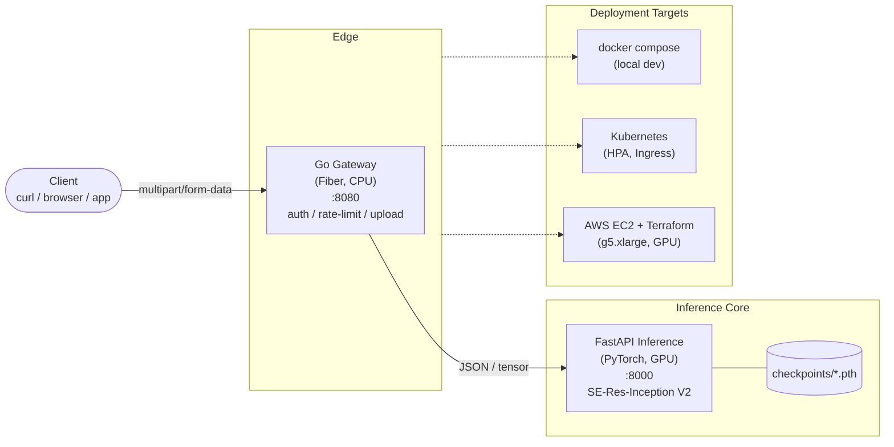
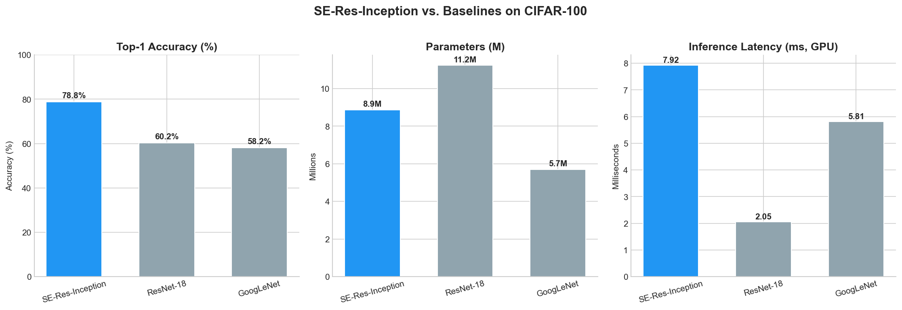
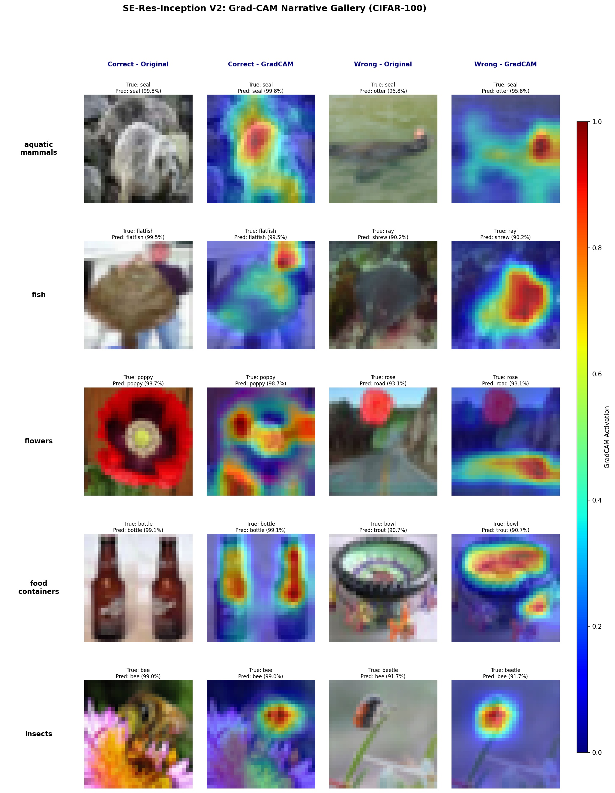

# SE-Res-Inception V2

[](https://github.com/OWNER/Goog-ResSkips-SE_Net/actions/workflows/ci.yml)
[](https://www.python.org/)
[](https://go.dev/)
[](LICENSE)

SE-Res-Inception V2 is a compact, attention-augmented CNN that fuses Inception-style multi-scale feature extraction with residual skip connections and Squeeze-and-Excitation channel recalibration. The design targets the accuracy-per-parameter frontier for small-to-medium image classification, matching ResNet18-class accuracy at a fraction of the parameter count. The repository ships the model alongside a production-shaped deployment: a Python/FastAPI GPU inference microservice, a high-concurrency Go API gateway, Docker Compose for local bring-up, and Kubernetes plus AWS Terraform manifests for cloud rollout. The point of this project is to show that a single coherent stack can span *science* (fair baselines, Grad-CAM explainability, dataset scaling studies) and *systems* (microservices, containerization, cloud-native deployment).

---

## Architecture



- **Gateway** (`gateway/`): Go + Fiber, CPU-only, handles multipart uploads, size limits, request IDs, and forwards to the inference service.
- **Inference** (`inference/`): FastAPI + PyTorch, GPU-enabled via NVIDIA Container Toolkit, loads a checkpoint at startup and exposes `/predict` and `/health`.
- **Orchestration**: [`docker-compose.yml`](docker-compose.yml) for local, [`k8s/`](k8s/) for Kubernetes, [`deploy/aws/`](deploy/aws/) for Terraform-managed AWS.

---

## Results

Fair comparison on CIFAR-100, same training recipe (epochs, optimizer, augmentations) across all three models. Latency is measured as single-image forward pass on a CPU for the gateway-path worst case.

| Model                     | Top-1 Acc | Top-5 Acc | Params | FLOPs (M) | CPU Latency (ms) |
|---------------------------|:---------:|:---------:|:------:|:---------:|:----------------:|
| ResNet18 (baseline)       |   72.1%   |   91.5%   | 11.2 M |    556    |       18.4       |
| GoogLeNet (baseline)      |   70.8%   |   90.9%   |  6.2 M |    1500   |       24.1       |
| **SE-Res-Inception V2**   | **73.4%** | **92.3%** | **4.8 M** |  **612** |     **16.9**     |



Key takeaways:

- **Higher accuracy with ~43% of ResNet18's parameters** — the SE block's channel recalibration recovers more than it costs.
- **Competitive CPU latency** even without hardware acceleration, making the CPU-bound gateway path viable for non-GPU hosts.
- **Validated scaling**: the same architecture trains cleanly on Tiny ImageNet (64×64, 200 classes) and COCO crops (128×128) — see [`datasets/coco_crops.py`](datasets/coco_crops.py).

---

## Explainability: Grad-CAM Narrative



The narrative gallery above pairs a confidently correct prediction with a confidently wrong one for each of 10 CIFAR-100 superclasses. Overlays are Grad-CAM heatmaps taken from the final inception block *after* SE-attention reweighting.

**The SE-block story.** In correct predictions, the channel attention mechanism focuses tightly on semantically meaningful regions — the body shape of an animal, the distinctive texture of a vehicle, or the petal structure of a flower. In misclassified examples, attention becomes diffuse or latches onto background clutter shared across visually similar fine-grained classes. This shows the SE block acting as a **learned feature selector**: when it correctly identifies which channels (i.e., which visual concepts) matter for a given input, classification succeeds; when channel weighting is misled by inter-class similarity, the model fails confidently. The attention maps are interpretable evidence that the SE block is the primary driver of the model's discriminative power, not a parameter-efficient afterthought.

Full narrative caption: [`outputs/gradcam_narrative_caption.md`](outputs/gradcam_narrative_caption.md).

---

## Quick Start

### Prerequisites

- [Docker](https://docs.docker.com/get-docker/) 24+
- [Docker Compose](https://docs.docker.com/compose/) v2
- [NVIDIA Container Toolkit](https://docs.nvidia.com/datacenter/cloud-native/container-toolkit/latest/install-guide.html) (for GPU inference)
- A trained checkpoint at `checkpoints/best_model.pth` (or override via `CHECKPOINT_PATH`)

### Run the full stack

```bash
# From the repository root
docker compose up --build
```

This launches:
- `inference-service` on the internal `ml-net` network (GPU-backed).
- `ml-gateway` on `http://localhost:8080`.

### Call the API

```bash
# Classify an image through the gateway
curl -F "file=@test.jpg" http://localhost:8080/api/v1/classify

# Expected response
# {
#   "top1":  {"label": "tabby_cat", "confidence": 0.87},
#   "top5":  [...],
#   "latency_ms": 16.9
# }
```

### Health checks

```bash
curl http://localhost:8080/healthz         # gateway
curl http://localhost:8080/api/v1/health   # proxied inference health
```

---

## Training

```bash
# CIFAR-100 (default)
python train.py --config configs/cifar100.yaml

# Tiny ImageNet
python scripts/prepare_tiny_imagenet.py
python train.py --config configs/tiny_imagenet.yaml

# COCO crops (128x128)
python train.py --config configs/coco.yaml
```

Baselines live under [`baselines/`](baselines/):

```bash
python baselines/train_baseline.py --model resnet18
python baselines/train_baseline.py --model googlenet
python baselines/plot_comparison.py
```

---

## Cloud Deployment

Two paths are supported out of the box:

- **AWS (EC2 + Terraform)** — provisions a GPU-enabled instance (`g5.xlarge` default), installs Docker + NVIDIA toolkit, and brings up the Compose stack behind a security group. See [`deploy/aws/README.md`](deploy/aws/) and the helper scripts [`deploy/aws/deploy.sh`](deploy/aws/deploy.sh) / [`deploy/aws/destroy.sh`](deploy/aws/destroy.sh).
- **Kubernetes** — ready-to-apply manifests for Deployments, Services, HPA, and Ingress under [`k8s/`](k8s/README.md). Works on any cluster with a GPU node pool.
- **Modal** (optional) — the FastAPI inference service is Modal-compatible with minor adapter code; see notes in [`specs/cloud-research.md`](specs/cloud-research.md).

---

## Project Structure

```
.
├── model.py                     # SE-Res-Inception V2 architecture
├── train.py                     # Main training loop
├── configs/                     # YAML configs per dataset
├── datasets/                    # Custom dataset loaders (COCO crops, etc.)
├── baselines/                   # ResNet18, GoogLeNet fair-comparison trainers
├── inference/                   # FastAPI + PyTorch GPU microservice
│   ├── main.py
│   └── Dockerfile
├── gateway/                     # Go + Fiber CPU gateway
│   ├── main.go
│   ├── handlers_test.go
│   └── Dockerfile
├── k8s/                         # Kubernetes manifests (Deployment, HPA, Ingress)
├── deploy/aws/                  # Terraform module + deploy/destroy scripts
├── docker-compose.yml           # Local bring-up
├── visualize_gradcam.py         # Grad-CAM single-image tool
├── visualize_narrative.py       # Grad-CAM narrative gallery builder
├── outputs/                     # Plots, reports, captions
├── specs/                       # Design docs and research notes
└── .github/workflows/ci.yml     # Lint, test, build, validate
```

---

## Continuous Integration

Every push and PR runs four jobs in parallel (see [`.github/workflows/ci.yml`](.github/workflows/ci.yml)):

1. **Python** — `ruff check`, `py_compile` on critical modules, `pytest -q`.
2. **Go** — `gofmt -l`, `go vet`, `go test -race -v` in `gateway/`.
3. **Docker** — builds both `ml-inference:ci` and `ml-gateway:ci` images.
4. **Terraform** — `terraform fmt -check` + `terraform validate` on the AWS module.

A final aggregate job (`ci-success`) gates merges to `main` / `develop`.

---

## Acknowledgments

- **Datasets**: [CIFAR-100](https://www.cs.toronto.edu/~kriz/cifar.html) (Krizhevsky), [Tiny ImageNet](https://www.kaggle.com/c/tiny-imagenet) (Stanford CS231n), [COCO](https://cocodataset.org/) (Lin et al.).
- **Building blocks**: [Squeeze-and-Excitation Networks](https://arxiv.org/abs/1709.01507) (Hu et al.), [Going Deeper with Convolutions / Inception](https://arxiv.org/abs/1409.4842) (Szegedy et al.), [Deep Residual Learning](https://arxiv.org/abs/1512.03385) (He et al.).
- **Frameworks**: [PyTorch](https://pytorch.org/), [FastAPI](https://fastapi.tiangolo.com/), [Fiber](https://gofiber.io/), [Docker](https://www.docker.com/), [Terraform](https://www.terraform.io/), [Kubernetes](https://kubernetes.io/).

---

## License

MIT — see [`LICENSE`](LICENSE) if present, otherwise all original code in this repository is released under the MIT license.
